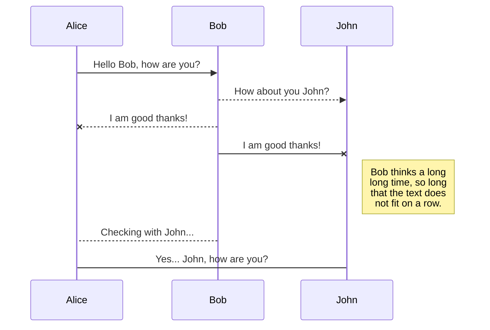
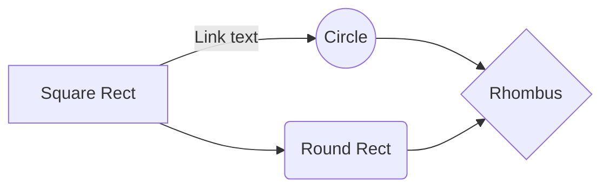

아래는 mermaid를 활용한 시퀀스 다이아그램이다.

간단한 플로우 챠트를 그려본다.


프로그래밍 언어 하이라이트
```go
package main
import (
   "fmt"
)
func main() {
   fmt.Printf("Hello world\n")
}
```
```c
int main(int argc, char **argv) {
   printf("Hello world\n");
}
```
